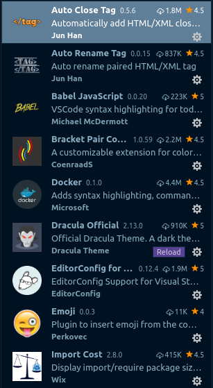
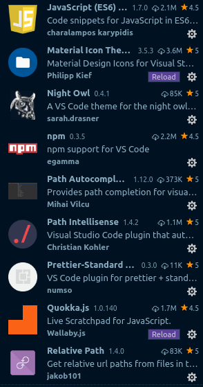
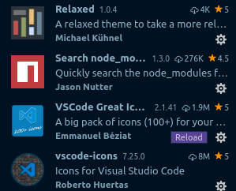
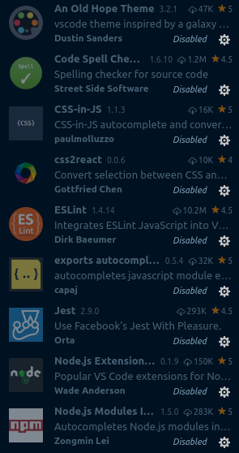
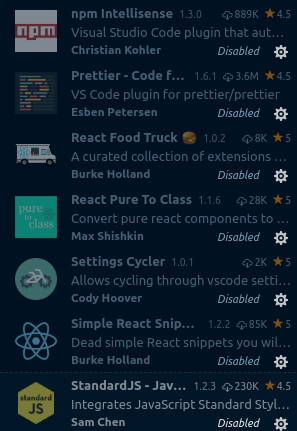

A simple bkcp for insider

```json 
{
    "workbench.iconTheme": "material-icon-theme",
    "workbench.colorTheme": "Night Owl",
    "window.menuBarVisibility": "toggle",
    "extensions.ignoreRecommendations": true,
    "extensions.showRecommendationsOnlyOnDemand": true,
    "editor.fontFamily": "'Dank Mono Italic','Operator Mono Lig Medium','Droid Sans Mono', 'monospace', monospace, 'Droid Sans Fallback', 'Noto Color Emoji'",
    "editor.fontSize": 18,
    "editor.fontLigatures": true,
    "zenMode.centerLayout": false,
    "terminal.integrated.fontSize": 16,
    "workbench.colorCustomizations": {
        "activityBar.background": "#08090a",
        "activityBar.border": "#102a44",
        "sideBar.background": "#001122",
        "statusBar.background": "#0c0c0c",
        "sideBar.border": "#102a44",
        "sideBar.foreground": "#8BADC1"
    },
    "javascript.validate.enable": false,
    "editor.formatOnSave": true
}

```

---
<span></span>
<span></span>
<span></span>

---
<span></span>
<span></span>